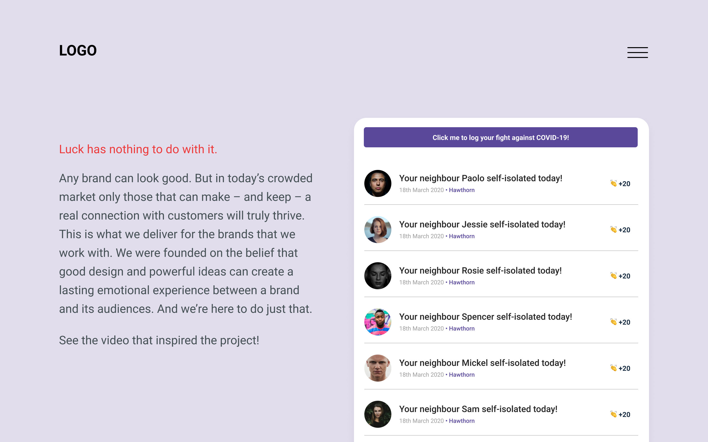
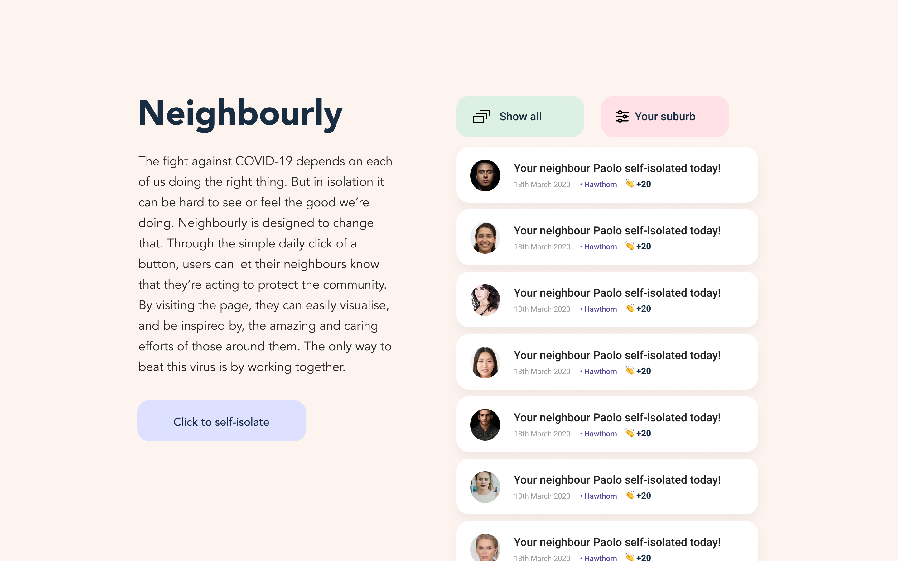
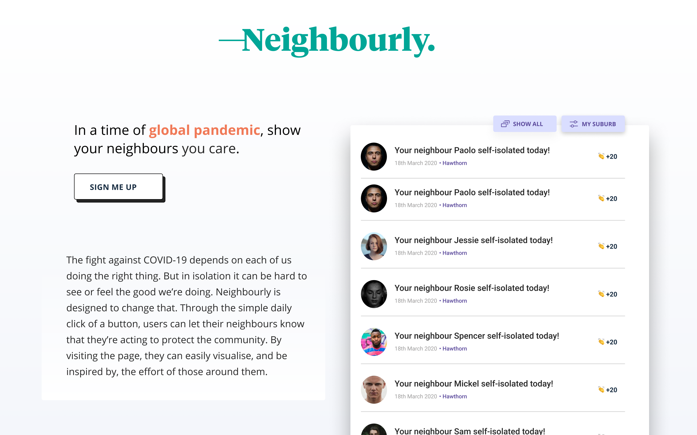
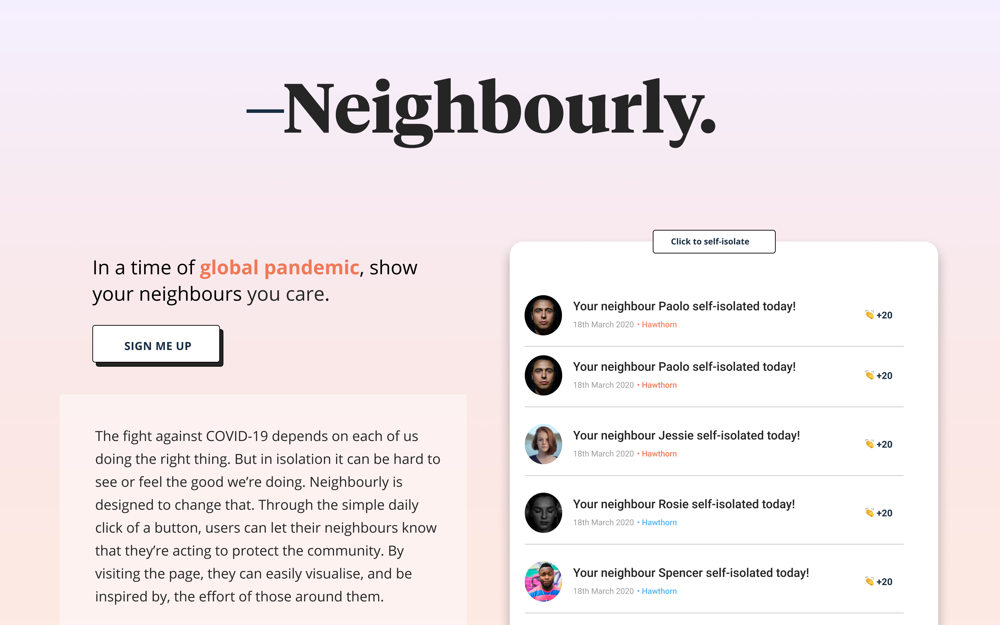

# How to run

  1. Run `npm i` in root
  2. In your terminal run `cd client`
  3. In `client` run `npm i`
  4. In root run `npm run dev` this will start both the back end and the front end 

# Neighbourly Community Project

  - This project was planned, designed and developed my Mark Tomlinson, Mahes Varier and Max Kelly. 
  - The idea for this project came from a [news report](https://www.youtube.com/watch?v=dJ1l5pGbFw0) back in March 2020 that emphasised the role community solidarity plays in ending pandemics. We wanted to make an app that could foster that solidarity by making individual efforts visible. 

## ERD

  - Below is the development life of our ERD. For our MVP you can see we started very simple.

  

## Design

  - We established early that a "feed" would be the best way to display the information logged by users. We decided to pin the accompanying "about" text to the left of the feed so that it would always be visible, no matter the length of the feed itself. The design underwent several iterations and is very much a work in progress. 

  

  

  

  

  

## Project management

  - The project management tool we used for this project was Github projects. We sought to automate this as much as possible with issues and cards, as you can see below.

  

  

  

